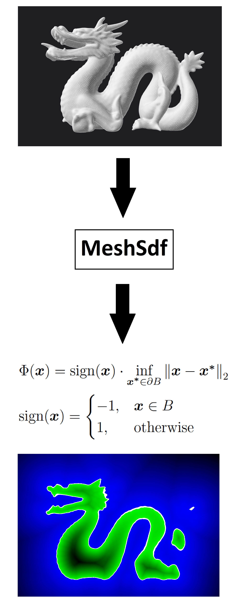

# MeshSdf

This small library computes the (signed) distance function associated with a triangle mesh. A demo program illustrates how the library can be used to visualize axis-aligned slices at z=c of the distance function.

The only required external dependency of the library is Boost. Boost.RTree is used for an accelerated lookup of the nearest triangle given a query point. (The demo program makes use of OpenMP if available to parallelize SDF evaluations.)

The library requires C++17 and has been tested under Visual Studio 2017 and Windows 10 but should port to other systems without major problems.

The library can be used under the terms of the MIT License.

	

